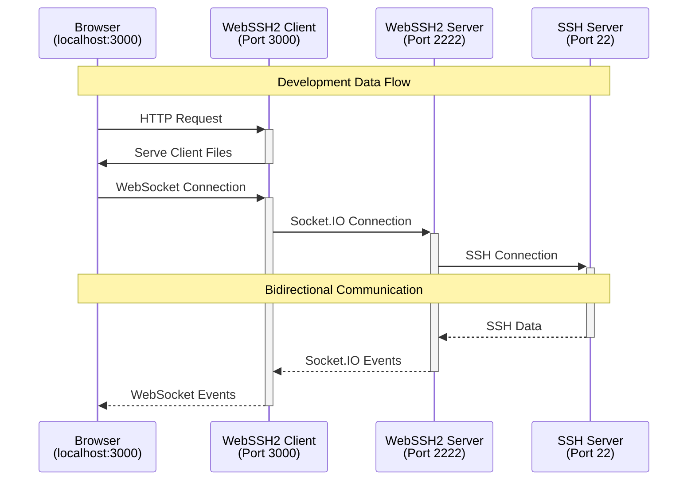

# WebSSH2 Development Guide

This guide explains how to set up and run the WebSSH2 client and server components for development.

## Prerequisites

- Node.js 22 LTS (Jod)
- npm
- Git
- Two terminal windows/sessions

## Project Setup

1. Create a development directory and clone both repositories:

```bash
mkdir webssh2-dev
cd webssh2-dev

# Clone the client repository
git clone https://github.com/billchurch/webssh2_client.git

# Clone the server repository
git clone https://github.com/billchurch/webssh2.git webssh2_server
```

2. Install dependencies for both projects:

```bash
# Install client dependencies
cd webssh2_client
npm install

# Install server dependencies
cd ../webssh2_server
npm install
```

## Development Workflow

### Starting the Server Component

1. In your first terminal window, navigate to the server directory:

```bash
cd webssh2_server
```

2. Start the server in development mode:

```bash
npm run watch
```

This will:
- Start the WebSSH2 server on port `2222`
- Enable automatic reloading when server files change
- Allow CORS for the development client

### Starting the Client Component

1. In your second terminal window, navigate to the client directory:

```bash
cd webssh2_client
```

2. Start the client in development mode:

```bash
npm run watch
```

This will:
- Start a development server on port `3000`
- Run `NODE_ENV=development npm-run-all --parallel start watch:build`
- Watch for file changes and rebuild automatically
- Inject development configuration into the client HTML

The development configuration is automatically injected through webpack.common.js when `NODE_ENV=development`:

```javascript
webssh2Config: {
  socket: { 
    url: 'http://localhost:2222', 
    path: '/ssh/socket.io' 
  },
  ssh: { 
    port: 22 
  }
}
```

### Accessing the Development Environment

1. Open your web browser and navigate to:
```
http://localhost:3000
```

2. The client will automatically connect to the development server at `localhost:2222`

## Development Architecture



## File Watching and Auto-Reload

Both client and server components support file watching and automatic reloading:

- Client changes will trigger webpack to rebuild
- Server changes will trigger nodemon to restart

## Important Notes

1. The server and client components must use Socket.IO v2.2.0 for compatibility
2. Client development server (3000) and WebSSH2 server (2222) must run simultaneously
3. CORS is automatically handled in development mode
4. The development configuration is only injected in development mode

## Troubleshooting

If you encounter issues:

1. Ensure both servers are running (`npm run watch` in both directories)
2. Check the browser console for client-side errors
3. Check terminal output for server-side errors
4. Verify the ports (3000 and 2222) are available
5. Clear browser cache if changes aren't reflecting

## Building for Production (client)

When ready to build for production:

```bash
cd webssh2_client
npm run build
```

This will create production-ready files in the `client/public` directory without the development configuration injection.