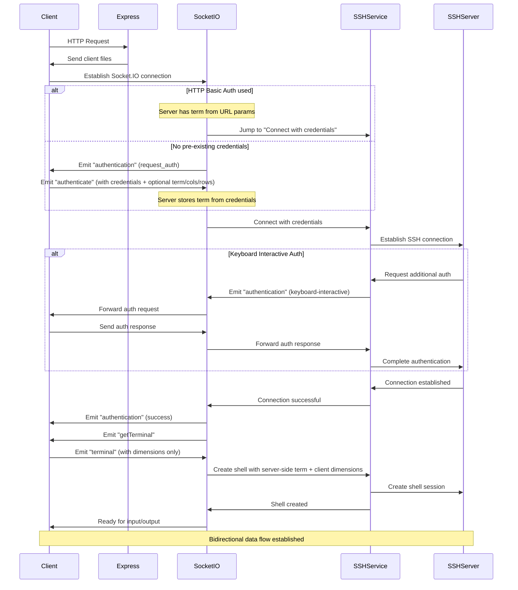

# Application Flow

```mermaid
sequenceDiagram
    participant Client
    participant Express
    participant SocketIO
    participant SSHService
    participant SSHServer

    Client->>Express: HTTP Request
    Express->>Client: Send client files
    Client->>SocketIO: Establish Socket.IO connection
    alt HTTP Basic Auth used
        Note over SocketIO: Server has term from URL params
        SocketIO->>SSHService: Jump to "Connect with credentials"
    else No pre-existing credentials
        SocketIO->>Client: Emit "authentication" (request_auth)
        Client->>SocketIO: Emit "authenticate" (with credentials + optional term/cols/rows)
        Note over SocketIO: Server stores term from credentials
    end
    SocketIO->>SSHService: Connect with credentials
    SSHService->>SSHServer: Establish SSH connection
    alt Keyboard Interactive Auth
        SSHServer->>SSHService: Request additional auth
        SSHService->>SocketIO: Emit "authentication" (keyboard-interactive)
        SocketIO->>Client: Forward auth request
        Client->>SocketIO: Send auth response
        SocketIO->>SSHService: Forward auth response
        SSHService->>SSHServer: Complete authentication
    end
    SSHServer->>SSHService: Connection established
    SSHService->>SocketIO: Connection successful
    SocketIO->>Client: Emit "authentication" (success)
    SocketIO->>Client: Emit "getTerminal"
    Client->>SocketIO: Emit "terminal" (with dimensions only)
    SocketIO->>SSHService: Create shell with server-side term + client dimensions
    SSHService->>SSHServer: Create shell session
    SSHService->>SocketIO: Shell created
    SocketIO->>Client: Ready for input/output
    Note over Client,SSHServer: Bidirectional data flow established
```