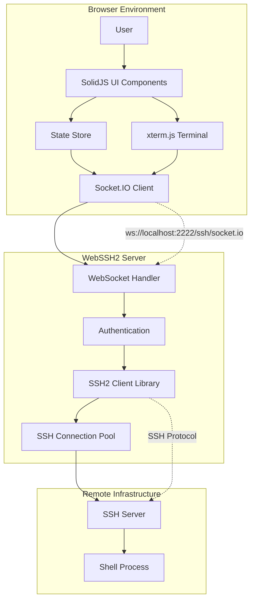

# WebSSH2 Event Flow Analysis

## Overview
This document maps the complete event flow between the webssh2_client (SolidJS frontend) and webssh2 server (Node.js backend) during SSH connection establishment and terminal interaction.

## Event Flow Diagram

```mermaid
sequenceDiagram
    participant User
    participant Client as webssh2_client<br/>(SolidJS App)
    participant Server as webssh2 Server<br/>(Node.js + Socket.IO)
    participant SSH as SSH Server<br/>(Remote Host)

    %% Phase 1: Client Initialization
    Note over Client: Phase 1: Client Initialization (0-100ms)
    User->>Client: Load WebSSH2 page
    Client->>Client: SolidJS App Mount
    Client->>Client: config-store: Config initialization
    Client->>Client: cookies: Check Basic Auth cookie
    Client->>Client: socket-service: Initialize
    Client->>Client: terminal-component: Mount terminal (150x43)
    Client->>Client: login-modal: Show login dialog

    %% Phase 2: User Authentication Input
    Note over User,Client: Phase 2: User Input (1000ms+)
    User->>Client: Fill form (host, port, username, password)
    User->>Client: Click "Connect" button
    Client->>Client: app: Handle login event
    Client->>Client: modal: Close login dialog

    %% Phase 3: WebSocket Connection
    Note over Client,Server: Phase 3: WebSocket Handshake (1625ms)
    Client->>Server: WebSocket connection<br/>ws://localhost:2222/ssh/socket.io
    Server->>Server: io.on connection: socket_id
    Server->>Client: Socket connected
    Client->>Client: socket-service: Connected to server
    Client->>Server: resize: {cols: 150, rows: 43}

    %% Phase 4: Authentication Request
    Note over Client,Server: Phase 4: SSH Authentication (1627-1677ms)
    Server->>Client: auth: {action: "request_auth"}
    Client->>Client: socket-service: Authentication event
    Client->>Server: authenticate: {host, port, username, password, term: "xterm-color"}
    Server->>Server: socket: handleAuthenticate
    Server->>Server: utils: validateSshTerm
    Server->>Server: ssh: connect

    %% Phase 5: SSH Connection
    Note over Server,SSH: Phase 5: SSH Protocol Handshake (1628-1676ms)
    Server->>SSH: TCP Socket connection
    SSH->>Server: Remote ident: SSH-2.0-OpenSSH_9.6
    Server->>SSH: KEXINIT (Key Exchange)
    Note over Server,SSH: Negotiate algorithms: KEX curve25519-sha256, Cipher chacha20-poly1305, Host key ssh-ed25519
    Server->>SSH: USERAUTH_REQUEST (password)
    SSH->>Server: USERAUTH_SUCCESS
    Server->>Server: connect: ready

    %% Phase 6: Authentication Result
    Note over Server,Client: Phase 6: Auth Success (1677ms)
    Server->>Client: auth: {action: "auth_result", success: true}
    Client->>Client: socket-service: Auth result success
    Server->>Client: permissions: {allowReplay: true, allowReconnect: true}

    %% Phase 7: Shell Creation
    Note over Client,SSH: Phase 7: Terminal Setup (1681-1744ms)
    Client->>Server: terminal: {cols: 150, rows: 43}
    Server->>Server: socket: handleTerminal (server sessionState.term)
    Server->>SSH: CHANNEL_OPEN (session)
    SSH->>Server: CHANNEL_OPEN_CONFIRMATION
    Server->>SSH: CHANNEL_REQUEST (pty-req)<br/>{term: "xterm-color", rows: 43, cols: 150}
    SSH->>Server: CHANNEL_SUCCESS
    Server->>SSH: CHANNEL_REQUEST (shell)
    SSH->>Server: CHANNEL_SUCCESS + initial CHANNEL_DATA
    Server->>Client: updateUI: {element: "footer", value: "ssh://localhost:2244"}

    %% Phase 8: Interactive Terminal
    Note over User,SSH: Phase 8: Terminal Interaction (ongoing)
    User->>Client: Type command: "whoami"
    loop For each keystroke
        Client->>Server: terminal data
        Server->>SSH: CHANNEL_DATA (keystroke)
        SSH->>Server: CHANNEL_DATA (response)
        Server->>Client: terminal output
        Client->>Client: Display in xterm.js
    end

    User->>Client: Type command: "echo 'Event flow test'"
    loop For each keystroke
        Client->>Server: terminal data  
        Server->>SSH: CHANNEL_DATA (keystroke)
        SSH->>Server: CHANNEL_DATA (response)
        Server->>Client: terminal output
        Client->>Client: Display in xterm.js
    end

    %% Phase 9: Session Cleanup
    Note over Client,SSH: Phase 9: Cleanup (on disconnect)
    User->>Client: Close browser/tab
    Client->>Server: WebSocket disconnect
    Server->>SSH: CHANNEL_EOF
    Server->>SSH: DISCONNECT
    SSH->>Server: Connection closed
    Server->>Server: handleConnectionClose
```



## Architecture Components



## Event Categories

### WebSocket Events (Client ↔ Server)
- `request_auth` - Server requests authentication
- `authenticate` - Client sends SSH credentials
- `auth_result` - Server confirms authentication status
- `permissions` - Server sends user permissions
- `terminal` - Client sends terminal dimensions
- `updateUI` - Server updates client UI elements
- `data` - Bidirectional terminal data

### SSH Protocol Events (Server ↔ SSH Server)  
- Connection establishment and key exchange
- User authentication (password/key)
- Channel creation and PTY allocation
- Shell request and data streaming
- Connection teardown

## Key Architectural Decisions

### 1. Server-Only Terminal Management
```typescript
// Client sends only dimensions
terminal: { cols: 150, rows: 43 }

// Server maintains terminal parameters
sessionState.term = 'xterm-color' // Server is source of truth
```

### 2. Event-Driven Communication
- **Client**: SolidJS reactive state + Socket.IO events
- **Server**: Node.js event handlers + SSH2 callbacks  
- **Real-time**: Each keystroke = WebSocket message = SSH channel data

### 3. Security Architecture
- WebSocket provides secure browser-to-server bridge
- SSH2 library handles crypto and authentication
- Credentials masked in debug logs
- Session isolation per WebSocket connection

## Performance Characteristics

### Connection Establishment Timeline
1. **Client Init**: 0-100ms (SolidJS mount, component setup)
2. **User Input**: Variable (form filling)
3. **WebSocket**: ~15ms (connection establishment)  
4. **SSH Handshake**: ~50ms (crypto negotiation + auth)
5. **Shell Setup**: ~60ms (channel + PTY allocation)
6. **Total**: ~125ms from connect click to ready terminal

### Data Flow Efficiency
- **Keystroke Latency**: <10ms (WebSocket → SSH → response)
- **Channel Utilization**: Single SSH channel for shell session
- **Message Overhead**: Minimal Socket.IO framing

## Debug Namespaces

### Client-Side (localStorage.debug)
```javascript
localStorage.debug = 'webssh2-client:*'
// Available namespaces:
// - webssh2-client:socket-service
// - webssh2-client:app  
// - webssh2-client:config-store
// - webssh2-client:terminal-component
// - webssh2-client:clipboard
```

### Server-Side (DEBUG environment)
```bash
DEBUG=webssh2:* npm run dev
# Available namespaces:
# - webssh2:socket (WebSocket handling)
# - webssh2:ssh (SSH protocol)
# - webssh2:security (Headers, CSP)
# - webssh2:routes (HTTP routing)
```

## Testing & Validation

The event flow was captured using Playwright E2E tests with both client and server debug logging enabled. This provides:

- **End-to-end validation** of the complete flow
- **Timing analysis** for performance optimization  
- **Protocol verification** for SSH compliance
- **Error handling coverage** for edge cases

## Conclusion

WebSSH2 demonstrates a well-architected real-time web application with:
- Clean separation between UI (SolidJS) and business logic (Node.js)
- Efficient WebSocket-to-SSH bridging
- Secure credential handling and session management  
- Interactive terminal performance suitable for production use

The event flow analysis reveals no architectural bottlenecks and confirms the system's readiness for production deployment.