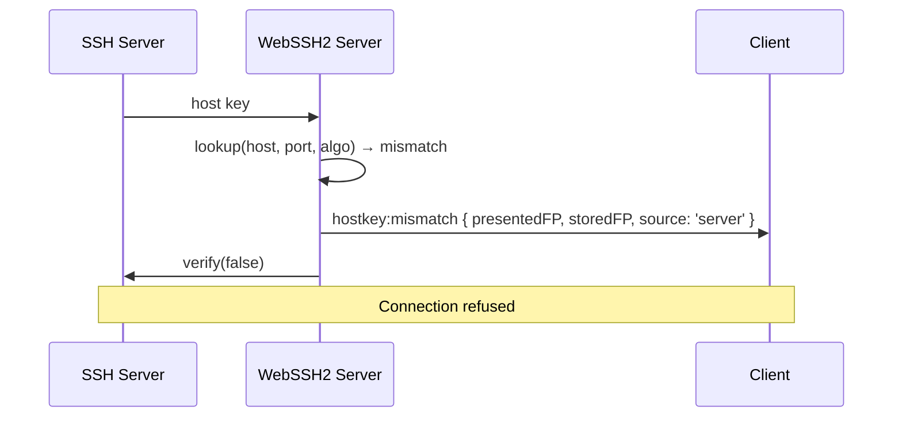
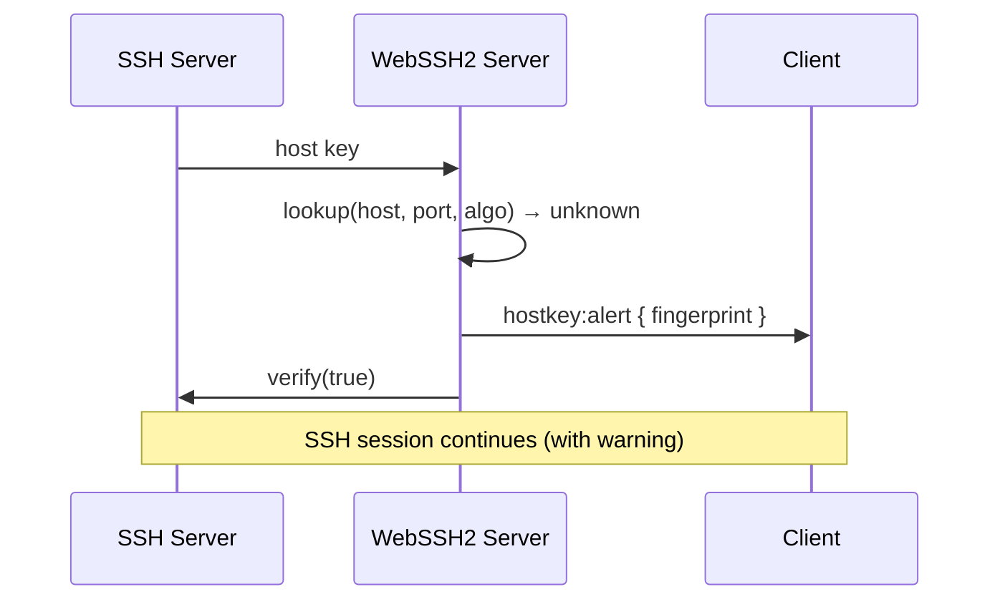
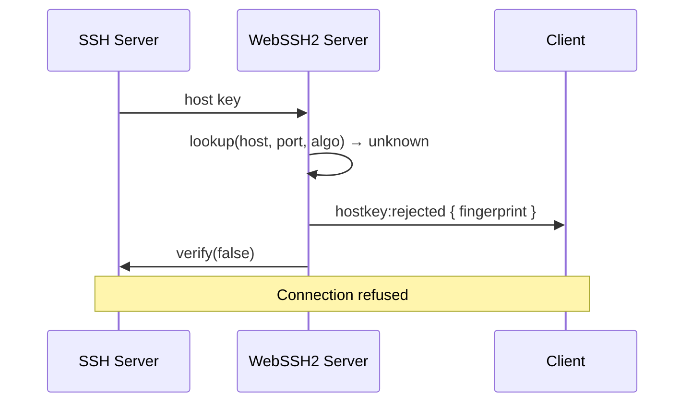
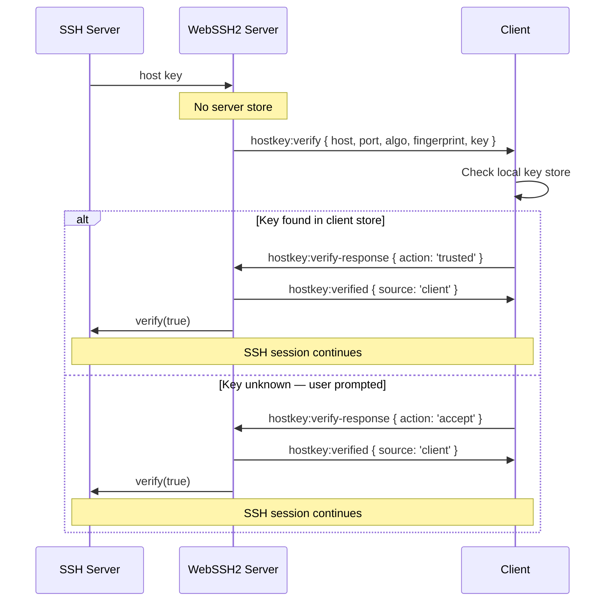
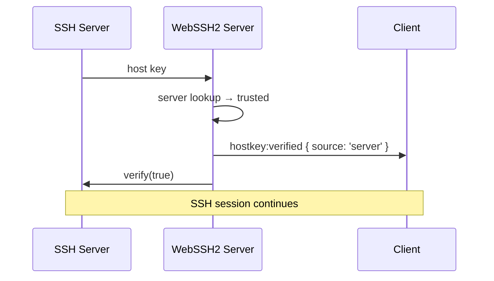
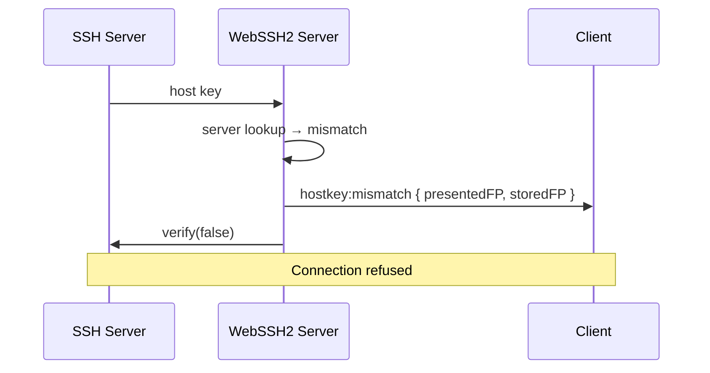
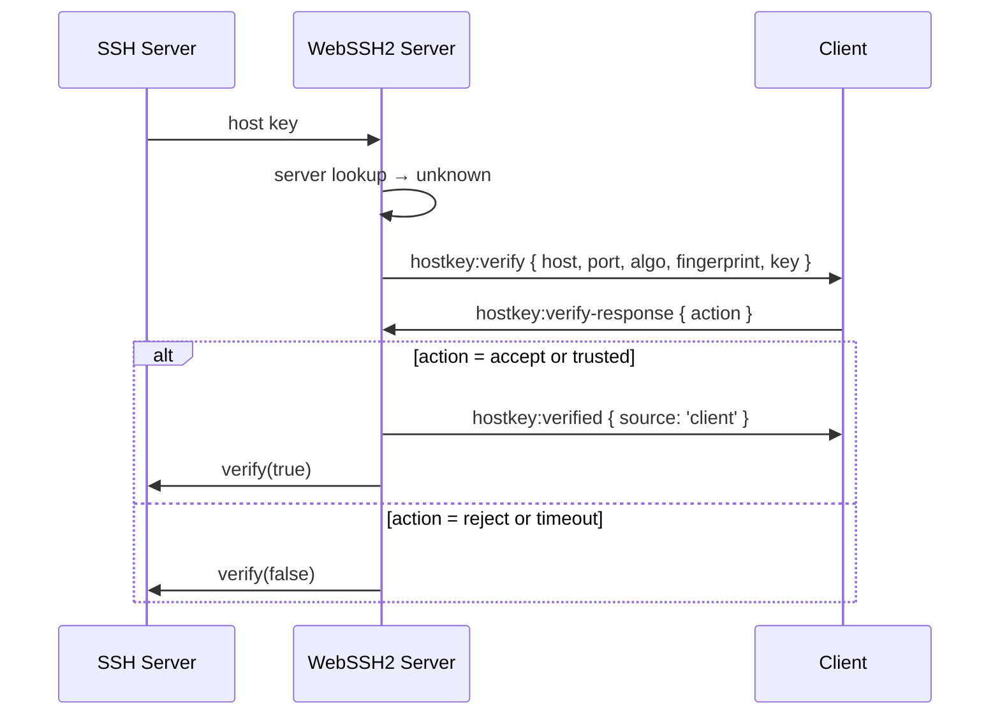
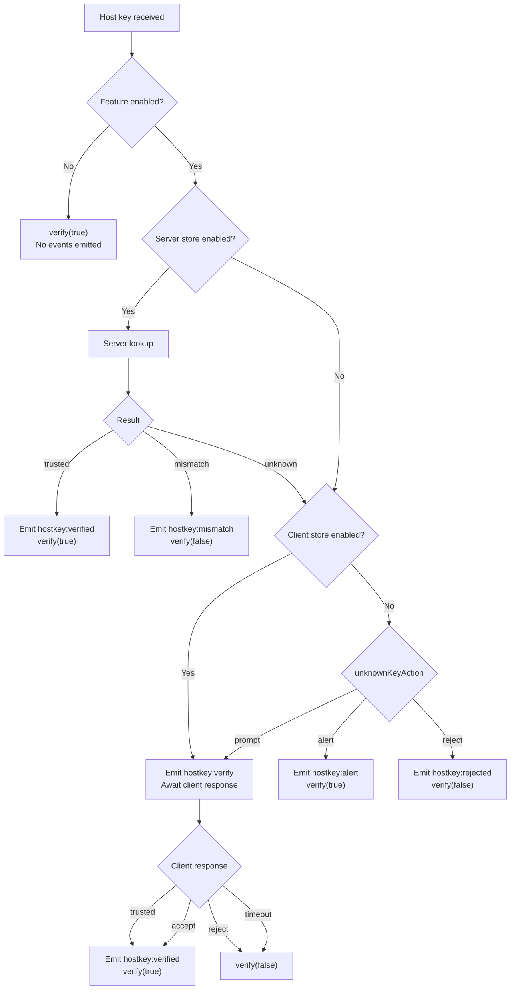

# Host Key Verification Socket Protocol Reference

## Overview

This document defines the Socket.IO event protocol used by WebSSH2 for SSH host key verification. It is intended for CLI client implementors, third-party client developers, and anyone building a custom frontend that connects to the WebSSH2 server over Socket.IO.

The host key verification subsystem allows the server and/or client to verify the identity of an SSH host before completing a connection. It supports three operational modes -- server-only, client-only, and hybrid -- each with distinct event flows described below.

**Source of truth**: `app/services/host-key/host-key-verifier.ts`

## Events Reference

All events use the `hostkey:` namespace prefix. Event names correspond to the constants defined in `app/constants/socket-events.ts`.

### Server to Client Events

| Event | Constant | Payload | Description |
| ----- | -------- | ------- | ----------- |
| `hostkey:verify` | `HOSTKEY_VERIFY` | `HostKeyVerifyPayload` | Server requests the client to verify an unknown host key |
| `hostkey:verified` | `HOSTKEY_VERIFIED` | `HostKeyVerifiedPayload` | Key was verified successfully; connection proceeds |
| `hostkey:mismatch` | `HOSTKEY_MISMATCH` | `HostKeyMismatchPayload` | Presented key does not match stored key; connection refused |
| `hostkey:alert` | `HOSTKEY_ALERT` | `HostKeyAlertPayload` | Unknown key encountered; warning only, connection proceeds |
| `hostkey:rejected` | `HOSTKEY_REJECTED` | `HostKeyRejectedPayload` | Unknown key rejected by policy; connection refused |

### Client to Server Events

| Event | Constant | Payload | Description |
| ----- | -------- | ------- | ----------- |
| `hostkey:verify-response` | `HOSTKEY_VERIFY_RESPONSE` | `HostKeyVerifyResponse` | Client's verification decision in response to `hostkey:verify` |

## Payload Schemas

All payloads are JSON objects transmitted as the first argument to `socket.emit()` / received as the first argument to the event handler.

### HostKeyVerifyPayload

Sent by the server with `hostkey:verify` when the client must decide whether to trust an unknown host key.

```typescript
interface HostKeyVerifyPayload {
  /** Hostname or IP of the SSH server */
  host: string
  /** Port number of the SSH server */
  port: number
  /** SSH key algorithm (e.g., "ssh-ed25519", "ssh-rsa", "ecdsa-sha2-nistp256") */
  algorithm: string
  /** SHA-256 fingerprint in "SHA256:<base64>" format */
  fingerprint: string
  /** Full public key, base64-encoded */
  key: string
}
```

### HostKeyVerifiedPayload

Sent by the server with `hostkey:verified` after a key has been accepted (by either the server store or the client).

```typescript
interface HostKeyVerifiedPayload {
  host: string
  port: number
  algorithm: string
  /** SHA-256 fingerprint of the verified key */
  fingerprint: string
  /** Which store confirmed the key */
  source: 'server' | 'client'
}
```

### HostKeyMismatchPayload

Sent by the server with `hostkey:mismatch` when the presented key does not match the key on file. The connection is always refused.

```typescript
interface HostKeyMismatchPayload {
  host: string
  port: number
  algorithm: string
  /** Fingerprint of the key presented by the remote SSH server */
  presentedFingerprint: string
  /** Fingerprint of the previously stored key, or "unknown" if unavailable */
  storedFingerprint: string
  /** Which store detected the mismatch */
  source: 'server' | 'client'
}
```

### HostKeyAlertPayload

Sent by the server with `hostkey:alert` when the key is unknown and the server is configured with `unknownKeyAction: 'alert'`. This is informational only -- the connection proceeds.

```typescript
interface HostKeyAlertPayload {
  host: string
  port: number
  algorithm: string
  /** SHA-256 fingerprint of the unknown key */
  fingerprint: string
}
```

### HostKeyRejectedPayload

Sent by the server with `hostkey:rejected` when the key is unknown and the server is configured with `unknownKeyAction: 'reject'`. The connection is refused.

```typescript
interface HostKeyRejectedPayload {
  host: string
  port: number
  algorithm: string
  /** SHA-256 fingerprint of the rejected key */
  fingerprint: string
}
```

### HostKeyVerifyResponse

Sent by the client with `hostkey:verify-response` in reply to a `hostkey:verify` prompt.

```typescript
interface HostKeyVerifyResponse {
  /** Client's verification decision */
  action: 'trusted' | 'accept' | 'reject'
}
```

**Action values:**

| Value | Meaning |
| ----- | ------- |
| `trusted` | The key was already in the client's local key store |
| `accept` | The key was unknown but the user chose to trust it |
| `reject` | The user declined to trust the key |

## Sequence Diagrams

### Server-Only Mode

Server store is enabled; client store is disabled.

#### Key Found (Trusted)


#### Key Mismatch



#### Key Unknown (unknownKeyAction: 'alert')



#### Key Unknown (unknownKeyAction: 'reject')



#### Key Unknown (unknownKeyAction: 'prompt')


### Client-Only Mode

Server store is disabled; client store is enabled.



### Hybrid Mode

Server store is checked first. If the key is unknown on the server, the client is consulted.

#### Server Found (Trusted)



No client interaction is needed when the server store recognizes the key.

#### Server Mismatch



A server-side mismatch is always fatal. The client is not consulted.

#### Server Unknown, Falls Through to Client



## Verification Flow

The server executes the following decision tree when an SSH host key is received. This matches the logic in `createHostKeyVerifier()`.



**Key rules:**

1. A server-side mismatch is always fatal. The client is never consulted.
2. The client is only prompted via `hostkey:verify` when the server store does not have the key (or is disabled) and either the client store is enabled or `unknownKeyAction` is `'prompt'`.
3. Both `'accept'` and `'trusted'` responses from the client are treated identically by the server -- both result in `verify(true)` and a `hostkey:verified` event with `source: 'client'`.
4. A `'reject'` response results in `verify(false)` with no additional events emitted to the client.

## Timeout Behavior

When the server emits `hostkey:verify` and awaits a client response, a timeout governs how long the server will wait.

| Parameter | Default | Description |
| --------- | ------- | ----------- |
| `timeout` | 30000 ms (30 seconds) | Maximum time to wait for `hostkey:verify-response` |

**When the timeout fires:**

1. The `hostkey:verify-response` listener is removed from the socket.
2. `verify(false)` is called, refusing the connection.
3. No additional events are emitted to the client.

The timeout is passed as the `timeout` option to `createHostKeyVerifier()`. It can be configured per-connection.

**Important**: If the client sends a response after the timeout has already fired, the response is silently ignored because the listener has been removed (via `socket.removeListener`). The SSH connection will have already been refused.

## Client Implementation Notes

### Handling Each Event

**`hostkey:verify`** -- The client must respond with `hostkey:verify-response` within the timeout window (default 30 seconds). This is the only event that requires a client response. The client should:

1. Check its local key store for the `host:port:algorithm` tuple.
2. If found and matching, respond with `{ action: 'trusted' }`.
3. If found but mismatched, the client should handle this locally (e.g., warn the user) and respond with `{ action: 'reject' }`.
4. If not found, display the fingerprint to the user and prompt for a decision:
   - User accepts: respond with `{ action: 'accept' }` and optionally save the key.
   - User declines: respond with `{ action: 'reject' }`.

**`hostkey:verified`** -- Informational. The key has been accepted and the SSH connection will proceed. The client may display a confirmation message, log the event, or silently continue. The `source` field indicates whether the server or client store was authoritative.

**`hostkey:mismatch`** -- The connection has already been refused by the server. The client should display a prominent warning to the user, including both the `presentedFingerprint` and `storedFingerprint`. This is a potential man-in-the-middle indicator.

**`hostkey:alert`** -- Informational warning. The key is unknown but the server allowed the connection (configured with `unknownKeyAction: 'alert'`). The client may display a notice or log the fingerprint. No response is required.

**`hostkey:rejected`** -- The connection has been refused because the key is unknown and server policy does not allow unknown keys (`unknownKeyAction: 'reject'`). The client should display an appropriate error.

### Action Values Summary

| Action | When to Send | Effect |
| ------ | ------------ | ------ |
| `trusted` | Key is already in the client's local key store and matches | Connection proceeds |
| `accept` | Key was unknown, user chose to trust it | Connection proceeds |
| `reject` | Key was unknown or mismatched, user declined | Connection refused |

### State Reset

All host key verification state is scoped to a single SSH connection attempt. On socket disconnect, the server cleans up any pending timeouts and listeners. The client should reset any in-progress verification UI on disconnect.

### Fingerprint Format

Fingerprints are SHA-256 hashes in `SHA256:<base64>` format, matching the convention used by OpenSSH. For example:

```text
SHA256:jMn3j6dsf7...base64...
```

This is computed from the raw public key bytes (decoded from base64), hashed with SHA-256, then re-encoded as base64.

## CLI Implementation Notes (Future Reference)

These are recommendations for building a command-line client that participates in the host key verification protocol.

### Suggested Key Store

Use `~/.ssh/known_hosts` in native OpenSSH format. This provides:

- Compatibility with existing SSH tooling (`ssh`, `ssh-keygen`, `scp`)
- No additional file management for users who already use SSH
- Established file format with broad library support

If OpenSSH format is impractical, a JSON-based store keyed by `host:port:algorithm` is acceptable.

### Interactive vs Batch Mode

| Mode | Behavior |
| ---- | -------- |
| **Interactive** | Prompt the user on `hostkey:verify`, display fingerprint, wait for yes/no |
| **Batch** | Apply policy without user interaction; fail-closed by default |

In interactive mode, display output similar to OpenSSH:

```text
The authenticity of host 'server1.example.com (192.168.1.10)' can't be established.
ssh-ed25519 key fingerprint is SHA256:jMn3j6dsf7...
Are you sure you want to continue connecting (yes/no)?
```

### Suggested CLI Flags

| Flag | Description | Default |
| ---- | ----------- | ------- |
| `--known-hosts <path>` | Path to known_hosts file | `~/.ssh/known_hosts` |
| `--accept-unknown` | Automatically accept unknown keys (respond `'accept'`); useful for scripting but insecure | Off |
| `--fingerprint <fp>` | Expect a specific fingerprint; respond `'trusted'` if it matches, `'reject'` otherwise | None |
| `--strict-host-keys` | Reject unknown keys (respond `'reject'`); equivalent to `StrictHostKeyChecking=yes` | Off |

### Batch Mode Policy

When no interactive terminal is available, the CLI should:

1. Check `--fingerprint` if provided. Respond `'trusted'` on match, `'reject'` on mismatch.
2. Check `--known-hosts` store. Respond `'trusted'` if found and matching.
3. If `--accept-unknown` is set, respond `'accept'`.
4. Otherwise, respond `'reject'` (fail-closed).

### Exit Codes

| Code | Meaning |
| ---- | ------- |
| 0 | Connection succeeded |
| 1 | General error |
| 2 | Host key verification failed (mismatch or rejected) |

### Mismatch Handling

On `hostkey:mismatch`, the CLI should print a prominent warning to stderr and exit with code 2, similar to OpenSSH:

```text
@@@@@@@@@@@@@@@@@@@@@@@@@@@@@@@@@@@@@@@@@@@@@@@@@@@@@
@    WARNING: REMOTE HOST IDENTIFICATION HAS CHANGED!
@@@@@@@@@@@@@@@@@@@@@@@@@@@@@@@@@@@@@@@@@@@@@@@@@@@@@
Host key for server1.example.com:22 has changed!
Stored:    SHA256:abc123...
Presented: SHA256:xyz789...
Host key verification failed.
```
