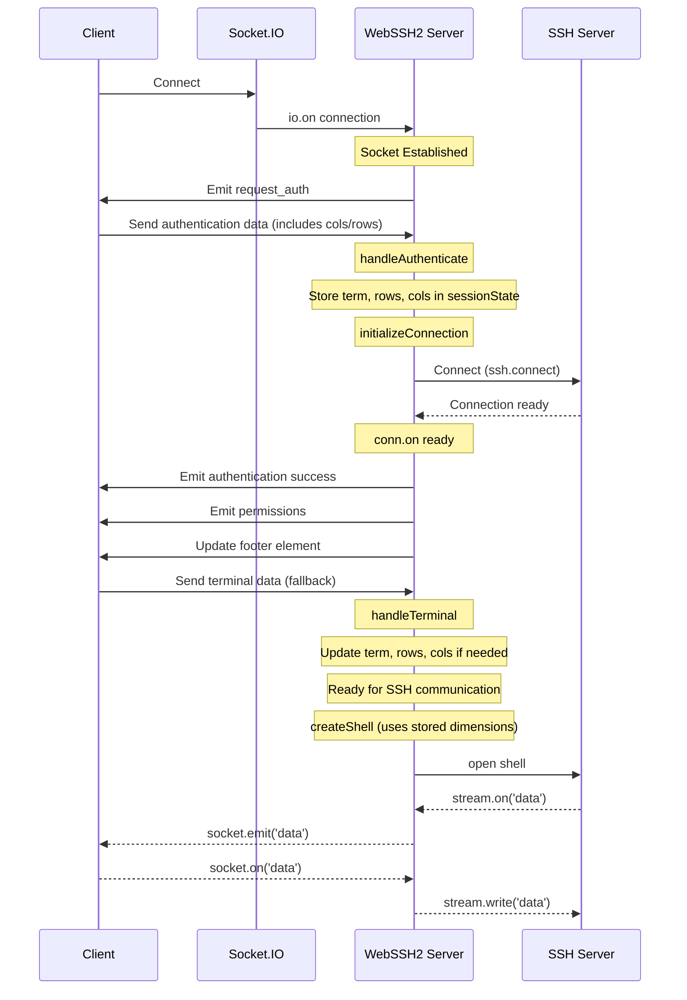

# Typical Event Flow

```mermaid
sequenceDiagram
    participant Client
    participant Socket.IO
    participant WebSSH2 Server
    participant SSH Server

    Client->>Socket.IO: Connect
    Socket.IO->>WebSSH2 Server: io.on connection
    Note over WebSSH2 Server: Socket Established
    WebSSH2 Server->>Client: Emit request_auth
    Client->>WebSSH2 Server: Send authentication data (includes cols/rows)
    Note over WebSSH2 Server: handleAuthenticate
    Note over WebSSH2 Server: Store term, rows, cols in sessionState
    Note over WebSSH2 Server: initializeConnection
    WebSSH2 Server->>SSH Server: Connect (ssh.connect)
    SSH Server-->>WebSSH2 Server: Connection ready
    Note over WebSSH2 Server: conn.on ready
    WebSSH2 Server->>Client: Emit authentication success
    WebSSH2 Server->>Client: Emit permissions
    WebSSH2 Server->>Client: Update footer element
    Client->>WebSSH2 Server: Send terminal data (fallback)
    Note over WebSSH2 Server: handleTerminal
    Note over WebSSH2 Server: Update term, rows, cols if needed
    Note over WebSSH2 Server: Ready for SSH communication
    Note over WebSSH2 Server: createShell (uses stored dimensions)
    WebSSH2 Server->>SSH Server: open shell
    SSH Server-->>WebSSH2 Server: stream.on('data')
    WebSSH2 Server-->>Client: socket.emit('data')
    Client-->>WebSSH2 Server: socket.on('data')
    WebSSH2 Server-->>SSH Server: stream.write('data')
```