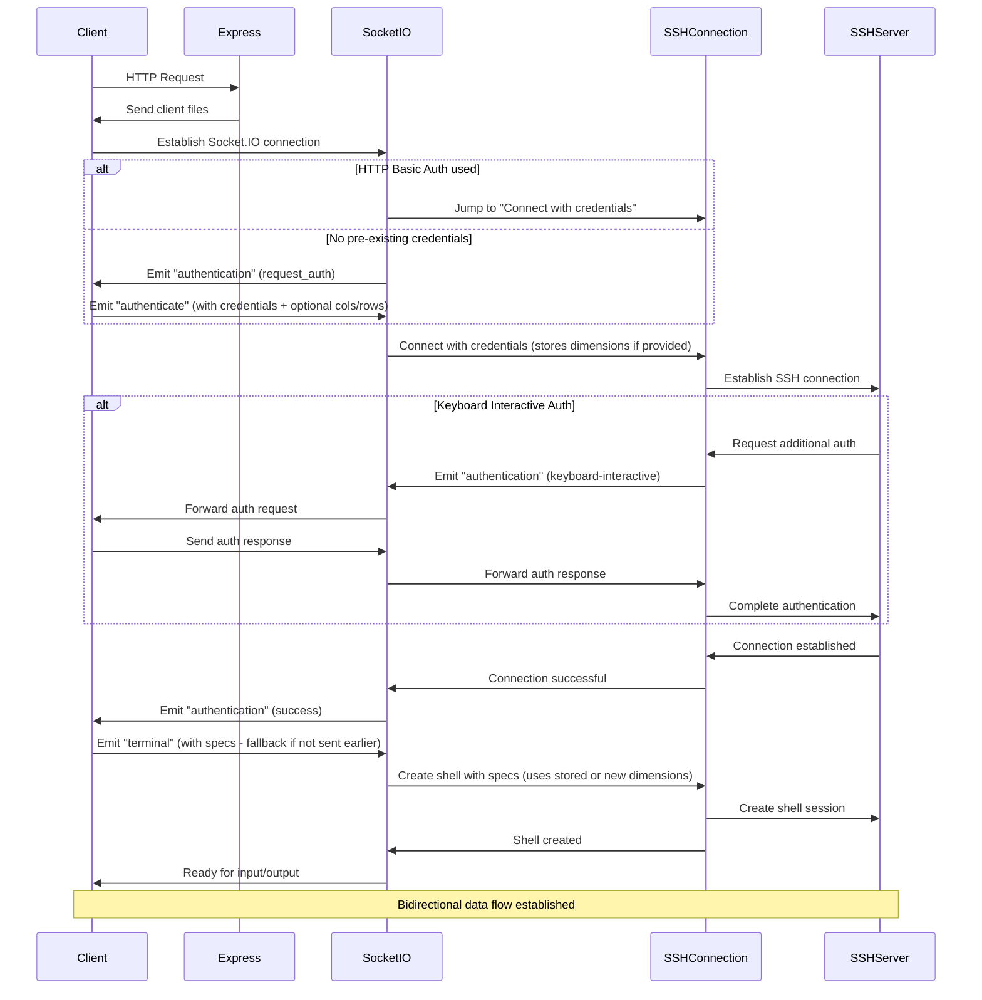

# Application Flow

```mermaid
sequenceDiagram
    participant Client
    participant Express
    participant SocketIO
    participant SSHConnection
    participant SSHServer

    Client->>Express: HTTP Request
    Express->>Client: Send client files
    Client->>SocketIO: Establish Socket.IO connection
    alt HTTP Basic Auth used
        SocketIO->>SSHConnection: Jump to "Connect with credentials"
    else No pre-existing credentials
        SocketIO->>Client: Emit "authentication" (request_auth)
        Client->>SocketIO: Emit "authenticate" (with credentials + optional cols/rows)
    end
    SocketIO->>SSHConnection: Connect with credentials (stores dimensions if provided)
    SSHConnection->>SSHServer: Establish SSH connection
    alt Keyboard Interactive Auth
        SSHServer->>SSHConnection: Request additional auth
        SSHConnection->>SocketIO: Emit "authentication" (keyboard-interactive)
        SocketIO->>Client: Forward auth request
        Client->>SocketIO: Send auth response
        SocketIO->>SSHConnection: Forward auth response
        SSHConnection->>SSHServer: Complete authentication
    end
    SSHServer->>SSHConnection: Connection established
    SSHConnection->>SocketIO: Connection successful
    SocketIO->>Client: Emit "authentication" (success)
    Client->>SocketIO: Emit "terminal" (with specs - fallback if not sent earlier)
    SocketIO->>SSHConnection: Create shell with specs (uses stored or new dimensions)
    SSHConnection->>SSHServer: Create shell session
    SSHConnection->>SocketIO: Shell created
    SocketIO->>Client: Ready for input/output
    Note over Client,SSHServer: Bidirectional data flow established
```