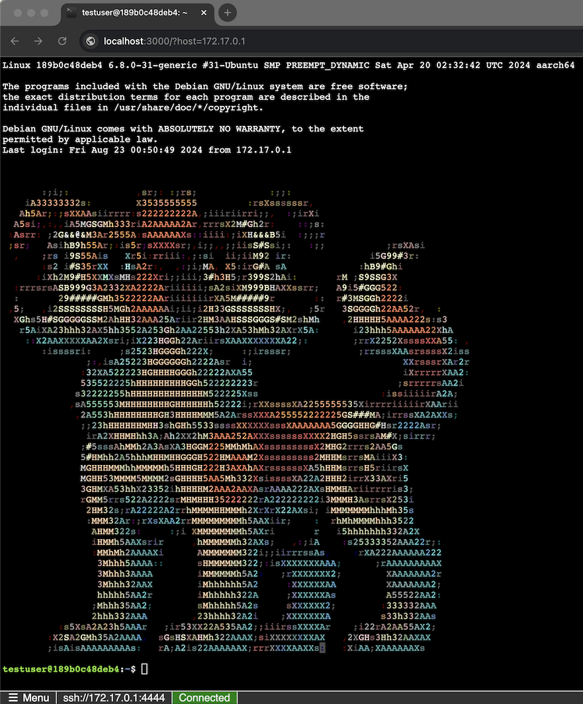

# WebSSH2 - Web SSH Client

[](./DOCS/development/CONTRIBUTING.md)


WebSSH2 is an HTML5 web-based terminal emulator and SSH client. It uses SSH2 as a client on a host to proxy a Websocket / Socket.io connection to an SSH2 server.



## Quick Start

### Requirements

- Node.js 22 LTS (Jod) or later

### Installation

```bash
# Clone repository
git clone https://github.com/billchurch/webssh2.git
cd webssh2

# Install dependencies
npm install --production

# Start server
npm start
```

Access WebSSH2 at: `http://localhost:2222/ssh`

### Docker

```bash
docker run --rm -p 2222:2222 billchurch/webssh2
```

## Configuration

WebSSH2 prefers environment variables for configuration (following 12-factor app principles):

```bash
# Basic configuration
export WEBSSH2_LISTEN_PORT=2222
export WEBSSH2_SSH_HOST=ssh.example.com
export WEBSSH2_HEADER_TEXT="My WebSSH2"

npm start
```

For detailed configuration options, see [Configuration Documentation](./DOCS/configuration/).

## Common Examples

### Connect to a specific host using HTTP Basic Auth

```
http://localhost:2222/ssh/host/192.168.1.100
```

### Custom port and terminal using interactive modal auth

```
http://localhost:2222/ssh?port=2244&sshterm=xterm-256color
```

### Docker with environment variables

```bash
docker run --rm -it \
  -p 2222:2222 \
  -e WEBSSH2_SSH_HOST=ssh.example.com \
  -e WEBSSH2_SSH_ALGORITHMS_PRESET=modern \
  billchurch/webssh2
```

## Documentation

### Getting Started
- [**Quick Start Guide**](./DOCS/getting-started/QUICK-START.md) - Get up and running in 5 minutes
- [Installation Guide](./DOCS/getting-started/INSTALLATION.md) - Detailed installation instructions
- [Docker Setup](./DOCS/getting-started/DOCKER.md) - Docker and Kubernetes deployment
- [Migration Guide](./DOCS/getting-started/MIGRATION.md) - Upgrading from older versions

### Configuration
- [Configuration Overview](./DOCS/configuration/OVERVIEW.md) - Configuration methods and priority
- [Environment Variables](./DOCS/configuration/ENVIRONMENT-VARIABLES.md) - Complete environment variable reference
- [URL Parameters](./DOCS/configuration/URL-PARAMETERS.md) - Query string parameters

### Features
- [Authentication Methods](./DOCS/features/AUTHENTICATION.md) - Password, key-based, and SSO
- [Private Key Authentication](./DOCS/features/PRIVATE-KEYS.md) - SSH key setup and usage
- [Exec Channel](./DOCS/features/EXEC-CHANNEL.md) - Non-interactive command execution
- [Environment Forwarding](./DOCS/features/ENVIRONMENT-FORWARDING.md) - Pass environment variables

### Development
- [Contributing Guide](./DOCS/development/CONTRIBUTING.md) - How to contribute
- [Development Setup](./DOCS/development/SETUP.md) - Setting up development environment
- [API Documentation](./DOCS/api/) - WebSocket and REST APIs

### Reference
- [Troubleshooting](./DOCS/reference/TROUBLESHOOTING.md) - Common issues and solutions
- [Breaking Changes](./DOCS/reference/BREAKING-CHANGES.md) - Version migration notes

## Features

- 🌐 **Web-based SSH** - No client software required
- 🔐 **Multiple Auth Methods** - Password, private key, keyboard-interactive
- 📱 **Responsive Design** - Works on desktop and mobile
- 🎨 **Customizable** - Themes, fonts, and terminal settings
- 🔌 **WebSocket** - Real-time bidirectional communication
- 🐳 **Docker Ready** - Official Docker images available
- 🔧 **Exec Channel** - Run commands without opening a shell
- 🌍 **Environment Variables** - Pass custom environment to SSH sessions
- 🛡️ **Subnet Restrictions** - IPv4/IPv6 CIDR subnet validation for access control

## Support

If you like what I do and want to support me, you can [buy me a coffee](https://www.buymeacoffee.com/billchurch)!

[](https://www.buymeacoffee.com/billchurch)

## License

[MIT License](LICENSE)